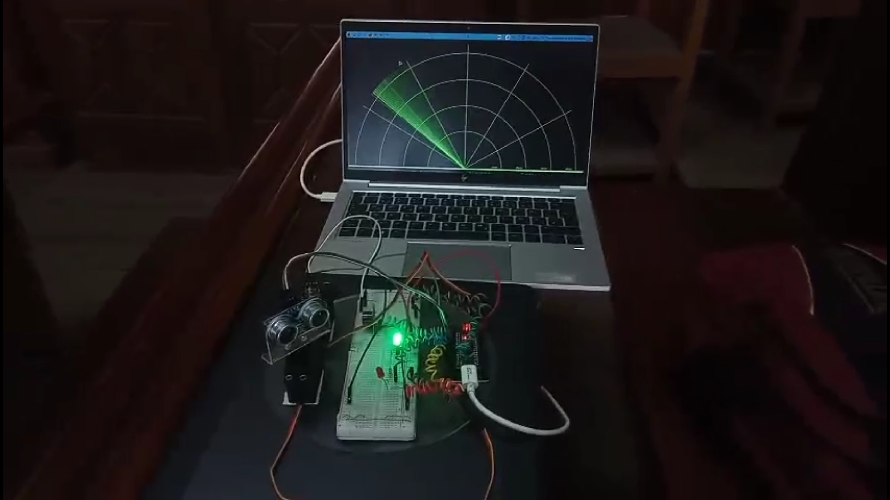
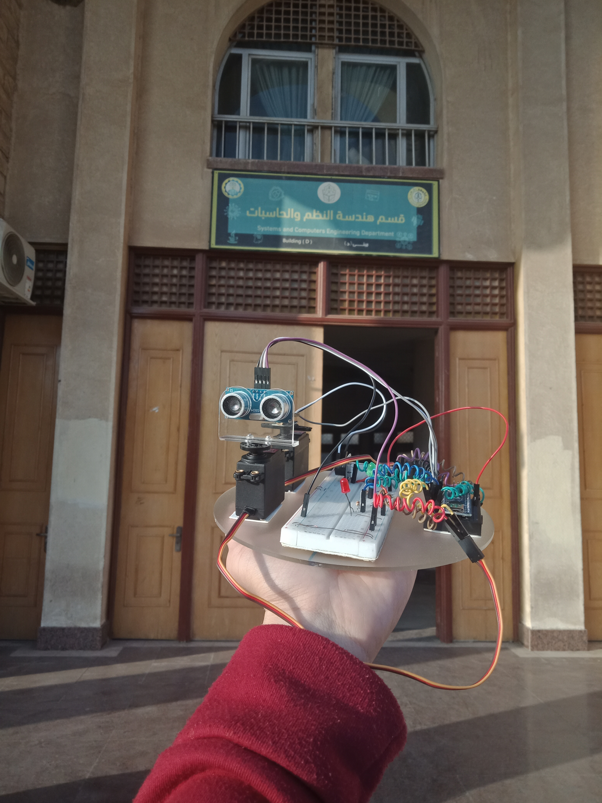
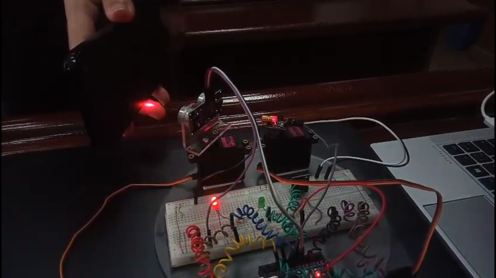
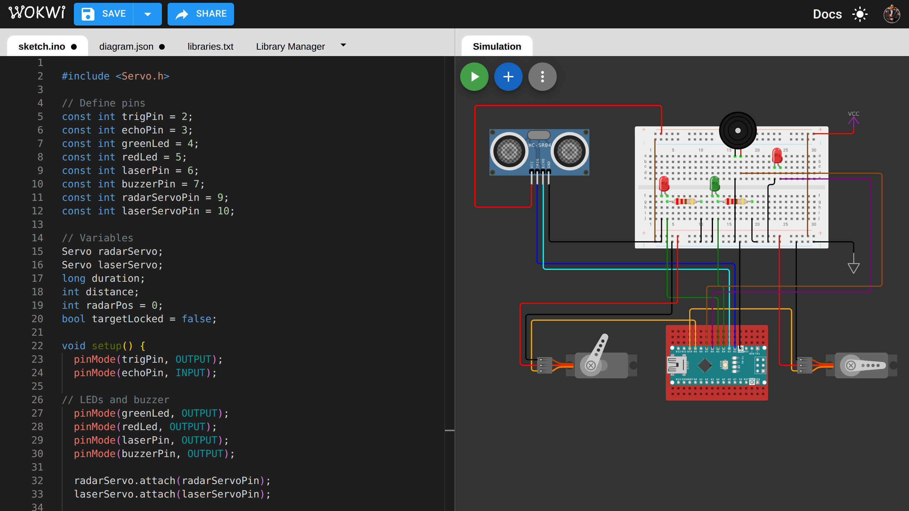
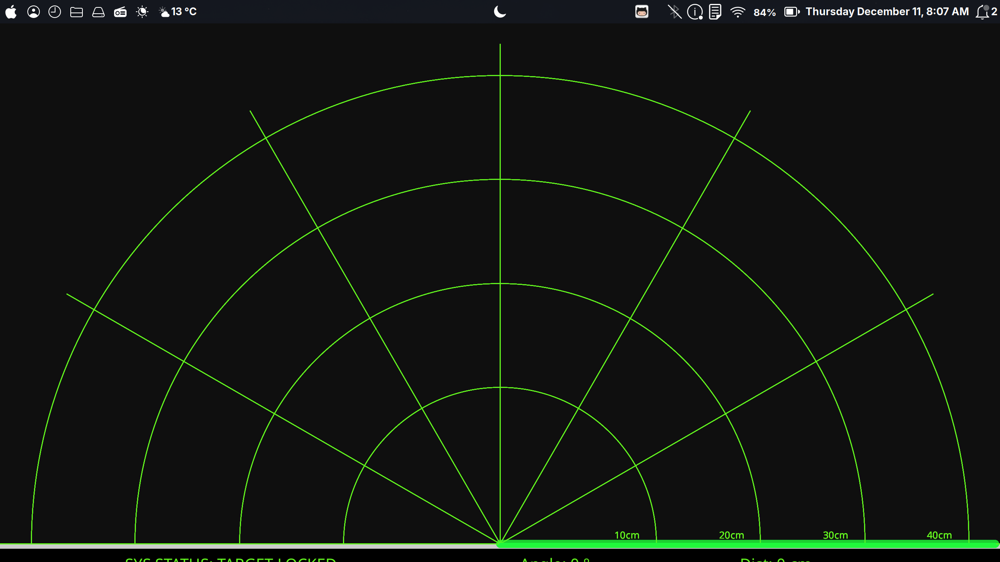

# 📡 Radar & Laser Defense System



> A fully integrated **Embedded System** that detects targets using ultrasonic waves, visualizes them on a real-time desktop GUI, and engages them with an automated laser turret.

## 🚀 Overview

This project bridges the gap between **Hardware Control** (Arduino) and **Software Visualization** (Processing). It simulates a military-grade defense system that:
1.  **Scans** an area (0° to 180°).
2.  **Detects** intruders via Ultrasonic sensors.
3.  **Visualizes** targets on a radar dashboard.
4.  **Locks & Engages** targets automatically with a laser turret.

## ✨ Key Features

### 🔌 Hardware (The Brain)
* **360° Scanning:** Uses a Servo Motor to sweep the area.
* **Target Detection:** Utilizing an **HC-SR04 Ultrasonic Sensor** for precise distance measurement.
* **Automated Engagement:** A secondary **Laser Turret (Servo + Laser)** automatically locks onto the target coordinates when detected.
* **Alarm System:** Visual (Red/Green LEDs) and Audio (Buzzer) alarms trigger upon detection.

### 💻 Software (The Eye)
* **Real-Time GUI:** A desktop application built with **Processing (Java)**.
* **Data Visualization:** Converts raw Serial data into a dynamic "Radar Screen" using polar-to-cartesian coordinate math.
* **Live Feedback:** Displays the Target Angle, Distance, and Status (In Range / Out of Range).

## 🛠️ Tech Stack & Components

* **Microcontroller:** Arduino Uno (C++).
* **Visualization:** Processing IDE (Java).
* **Sensors:** Ultrasonic Sensor (HC-SR04).
* **Actuators:** 2x SG90 Servo Motors, Laser Module, Buzzer.
* **Communication:** Serial UART (9600 Baud Rate).

## 📸 Real-World Implementation

| **Hardware Build** | **Target Engagement (Attacking)** |
|:---:|:---:|
|  |  |
| *Clean wiring with acrylic base* | *Laser locked on target with Red Alert* |

## 📊 Simulation & Logic

| **Circuit Diagram (Wokwi)** | **Radar Dashboard (Processing)** |
|:---:|:---:|
|  |  |

## 🧠 How It Works

1.  **Scanning Mode:** The Radar Servo sweeps back and forth while the Ultrasonic sensor measures distance continuously.
2.  **Data Transmission:** The Arduino sends `Angle,Distance.` via Serial port to the PC.
3.  **Visualization:** The Processing app parses this string and draws the green radar line and red object markers in real-time.
4.  **Target Locked:** If an object is detected within **30cm**:
    * The system halts scanning.
    * The **Laser Servo** moves to align with the target's angle.
    * The Laser fires, and the Buzzer sounds an alarm.
    * The system re-checks: if the target remains, it continues engaging; if cleared, it resumes scanning.

## 🚀 How to Run

### 1. Hardware Setup
Connect the components according to the circuit diagram shown in the screenshots.

### 2. Arduino Code
* Navigate to the `Arduino and Processing Codes` folder.
* Open `sketch.ino` (or the final version `.ino`).
* Upload the code to your Arduino board.

### 3. Processing Dashboard
* Install **Processing IDE**.
* Navigate to `Arduino and Processing Codes`.
* Open `Processing_Screen_Display.pde`.
* **Critical:** Update the Serial Port line in the code to match your system (e.g., `COM3` on Windows or `/dev/ttyUSB0` on Linux):
    ```java
    myPort = new Serial(this, "YOUR_PORT_HERE", 9600);
    ```
* Run the sketch.

## 🤝 Credits

* **Designed & Developed by:** [Eng. Omar Nasser](https://www.linkedin.com/in/omar-nasser-74226630b/)
* **Concept:** Inspired by classic radar interfaces and automated defense systems.

---
*Built with ❤️, Code, and a lot of wires.*
